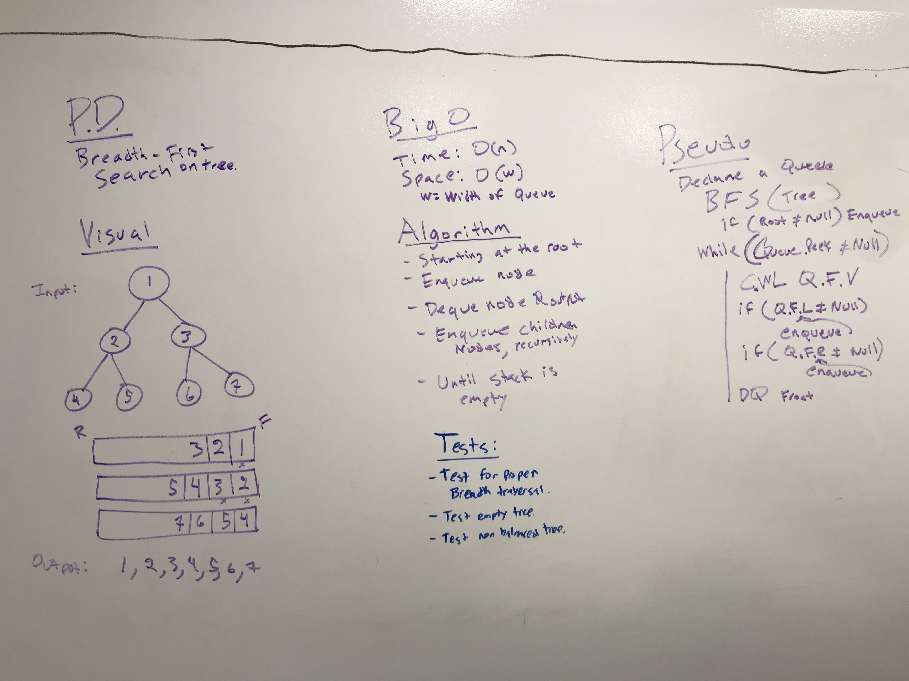

## Challenge
Implement a breadth-first search of a binary tree that prints out each node's value.

## Approach & Efficiency
* Time Complexity: O(n) - must visit every node of the tree
* Space Complexity: O(w) - w is the maximum width of the tree. The queue used to process nodes will ever only be as large as the largest widtch of the tree.
 

## Solution

