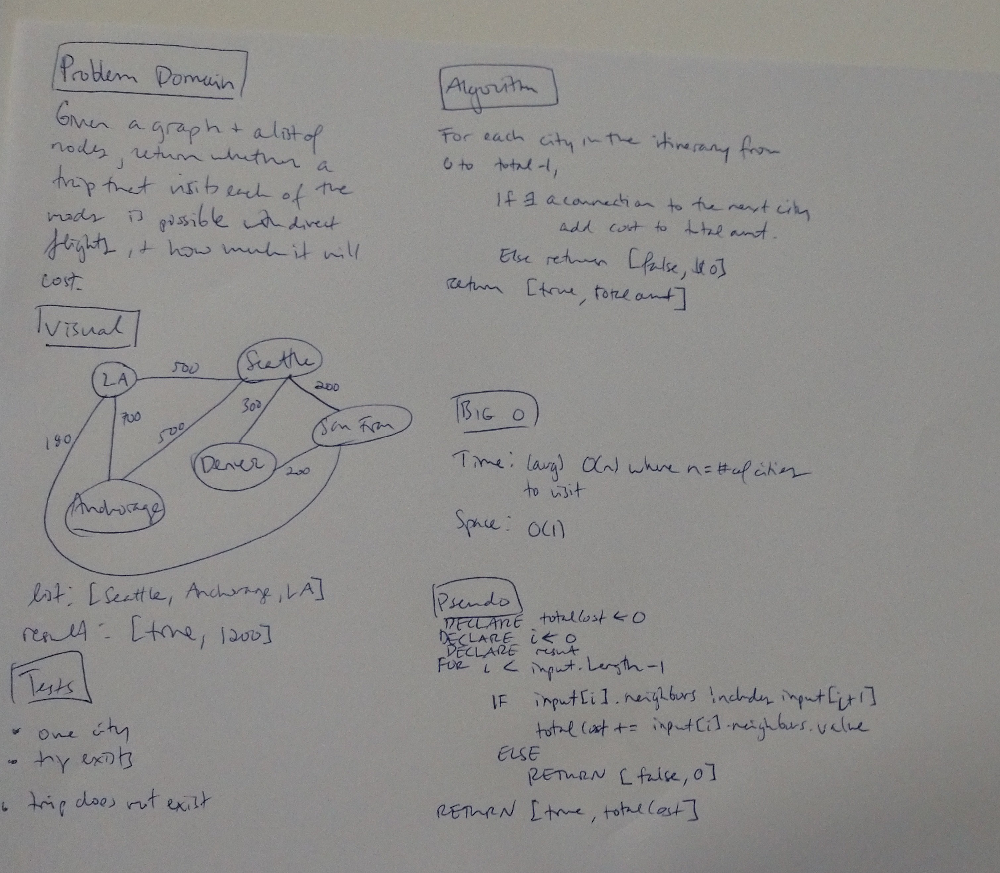

# Get Edges

## Challenge
Write a function based on the specifications above, which takes in a graph, and an array of city names. 
Without utilizing any of the built-in methods available to your language, return whether the full trip is possible with direct flights, 
and how much it would cost.

## Approach & Efficiency
* Time Complexity = O(n): Where n is the number of cities in the itinerary (this is average and assuming shallow buckets in the hashmap under the hood)
* Space Complexity = O(1)

 

## Solution

