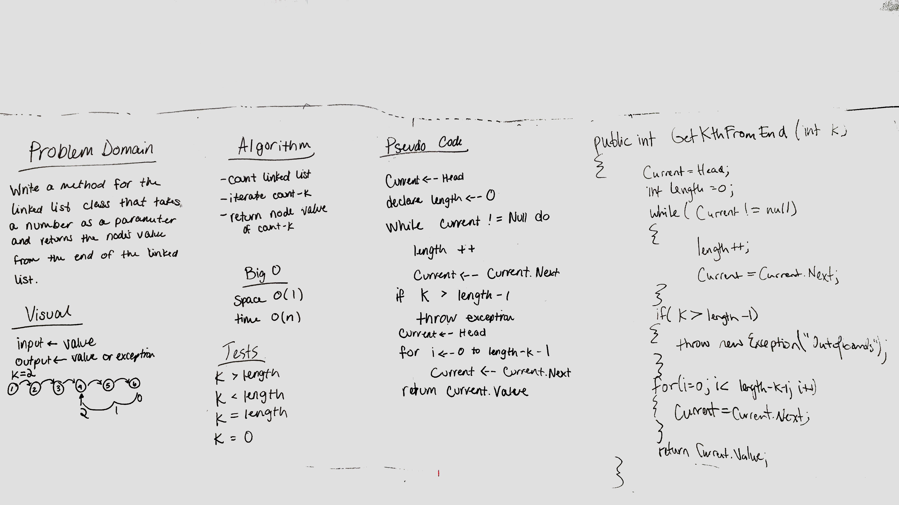

# Get kth value from the end of a linked list

## Challenge
Write a method on the LList class that returns the value of the kth node from the end of the linked list. If k is out of range (i.e., greater than length - k - 1), return an exception.

## Approach & Efficiency
Time Complexity = O(n): We must traverse and count all n nodes of the array to find the size (and again traverse up to n nodes to find the node that's k nodes from the end)
Space Compexity = O(1): No "containers" relative in size to n are needed.

## Solution

