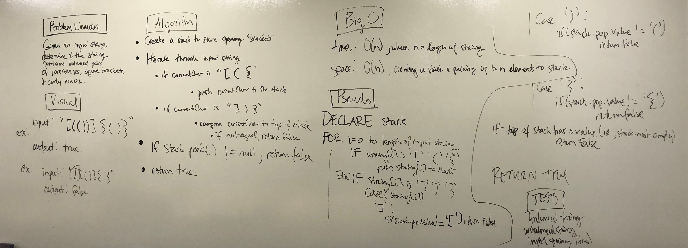

# Multi-Bracket Validation

## Challenge
Given an input string, determine whether the string contains balanced brackets ( [ {

## Approach & Efficiency
The solution uses a stack to store open brackets. Every time a closing bracket is encountered, the top of the stack is compared to the closing bracket.
If the string is balance, empty, or has no brackets, the method returns true. Otherwise, the method returns false.

* Big O
  Time Complexity = O(n): where n is the length of the string. We must check/process each character in the string
  Space Complexity = O(n): We must push up to n characters to the stack (ex. input = "((((((", n = 6, no value will ever be popped off the stack)

 

## Solution

