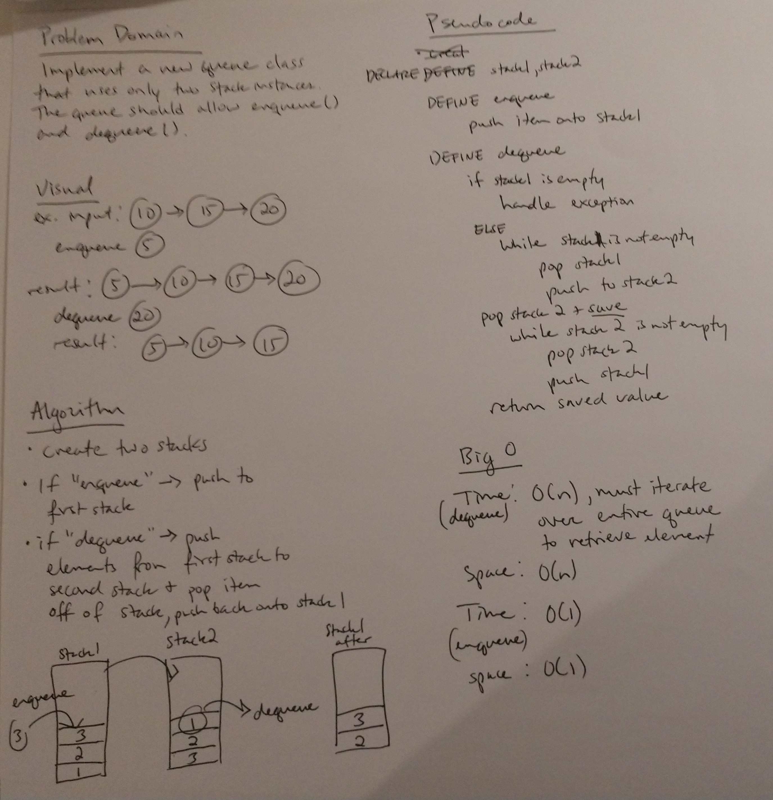

## Challenge
Implement a queue using only two Stacks that supports Enqueue() and Dequeue()

## Approach & Efficiency
* Dequeue()
  Time Complexity = O(n): We must iterate over all n elements of the queue to find the front
  Space Complexity = O(n): We use another stack of size n to access the front of the queue
* Enqueue()
  Time Complexity = O(1): Pushing an element to a stack is O(1)
  Space Complexity = O(1)
 

## Solution

