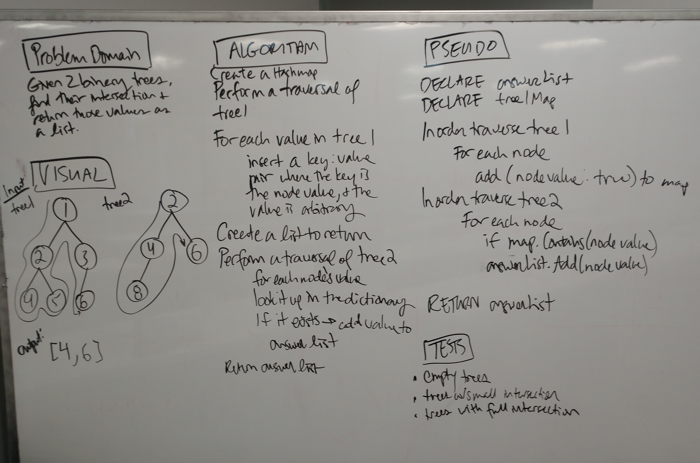

# Binary Tree Intersection

## Challenge
Implement a method that returns the intersection of two binary trees

## Approach & Efficiency
* Time Complexity = O(n+m): Where n is the size of tree 1 and m is the size of tree 2. We must iterate over all elements of each tree.
* Space Complexity = O(n): We use additional lists and maps of size n

 

## Solution

