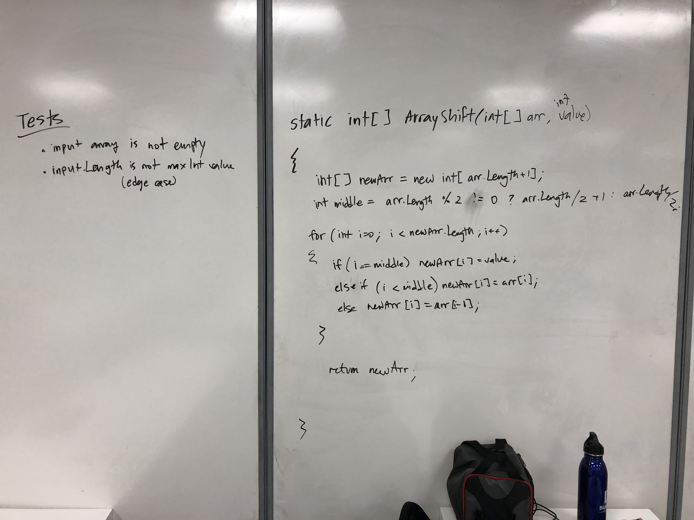

# Insert and shift middle index of array

## Challenge
Write a function called which takes in an array and the value to be added. Without utilizing any of the built-in methods available to your language, return an array with the new value added at the middle index.

## Approach & Efficiency
Time Complexity = O(n): We must copy n elements to the new array (where n is the size of the input array).
Space Compexity = O(n): We must create a new array of size n+1

## Solution

