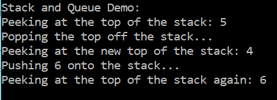
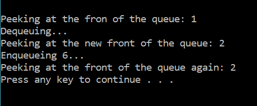

# Stack and Queue
* Stack implementation with Peek(), Push(), and Pop(). A data structure for last in, first out (LIFO) usage implemented with a singly-linked list. Useful for backtracking (e.g., broswer navigation history) and managing processes (e.g., computer memory stack).

  
* Queue implementation with Peek(), Enqueue(), and Dequeue(). A data structure for first in, first out (FIFO) usage. Useful for tracking requests that will be processed on a first-come, first-served basis and for managing multi-threaded processes.

  

